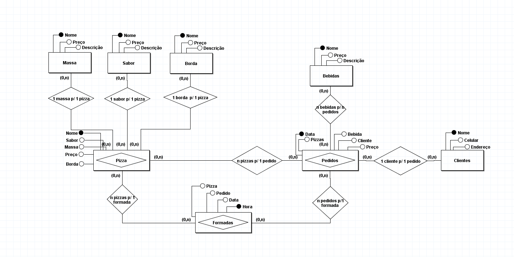

# Projeto Pizzaria
Este projeto foi desenvolvido em sala de aula como um exercício prático para a criação de um banco de dados para uma pizzaria. O projeto abrange todas as etapas de desenvolvimento de um banco de dados, desde a modelagem conceitual até a implementação física.

## Análise de Requisitos
A Análise de requisitos foi realizada com base em um documento já preparado pelo professor [Eduardo Inocencio](https://github.com/EduardoVitorInocencio) em  <a href="./Exercício 04 - Banco de Dados Pizzaria.pdf">Banco de Dados Pizzaria</a> .

## Modelo entidade Relacionamento

## Modelo Lógico
  - tblMassa - **Id**, descricao, preco.
  - tblSabor - **Id**, descricao, preco.
  - tblBorda - **Id**, descricao, preco.
  - tblPizza - **Id** , idMassa, idSabor, idBorda, preco.
  - tblBebida - **Id**, descricao, preço.
  - tblCliente - **Id**, nome, celular, endereco.
  - tblPedidos - **id**. data, idPizza, qtdePizzas, idBebida, qtdeBebidas, idCliente, preco.
  - tblFormadas - **hora**, data, idPizza, idPedido.

## Modelo Físico
O Script para criação do Modelo Físico do banco de dados está localizado em <a href="./BancoPizzaria.sql">BancoPizzaria.sql</a>

## Tecnologias
  - [BRModelo](https://github.com/chcandido/brModelo) - Utilizado para Criar o Modelo Entidade-Relacionamento.
  - [MySQL](https://dev.mysql.com/downloads/installer/) - banco de Dados Utilizado para criar o Modelo Físico do banco.
  - [MySQLWorkbench](https://dev.mysql.com/downloads/installer/) - IDE utilizada para Gerenciar o SGBD MySQL.

 

### Criado por
*[Rafael Novais](https://github.com/oN0V41S)*
